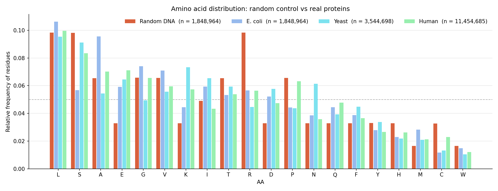
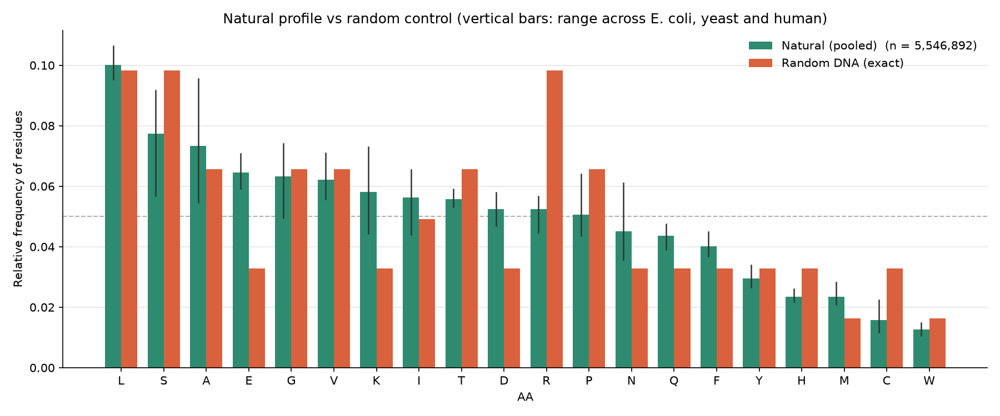
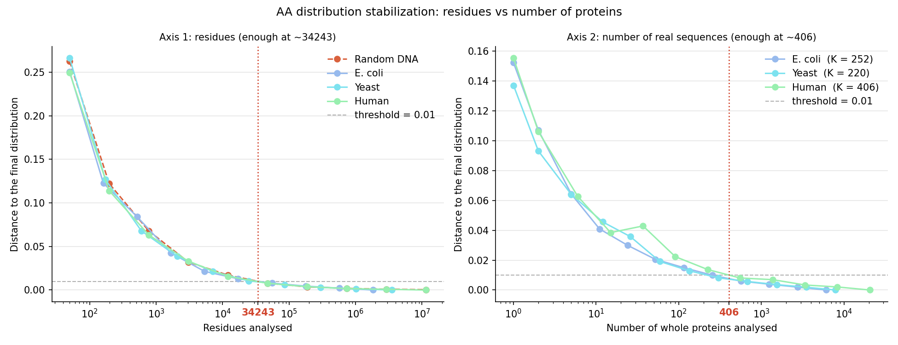
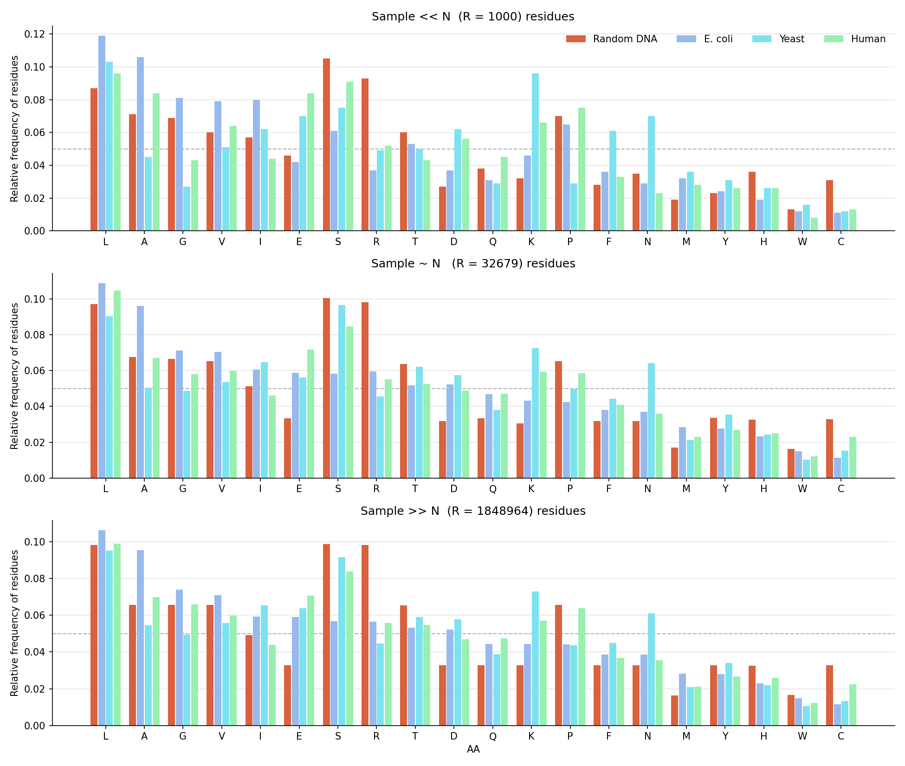
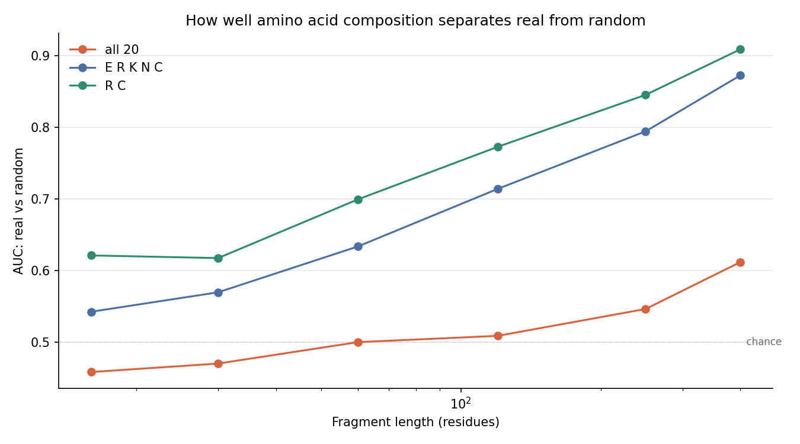
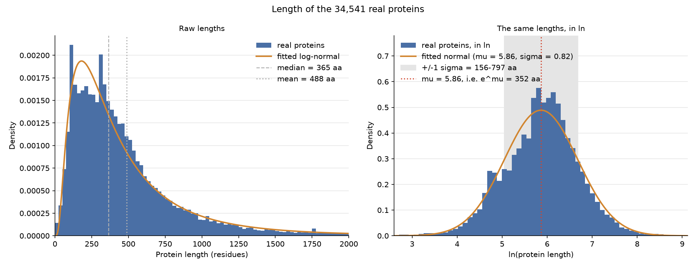
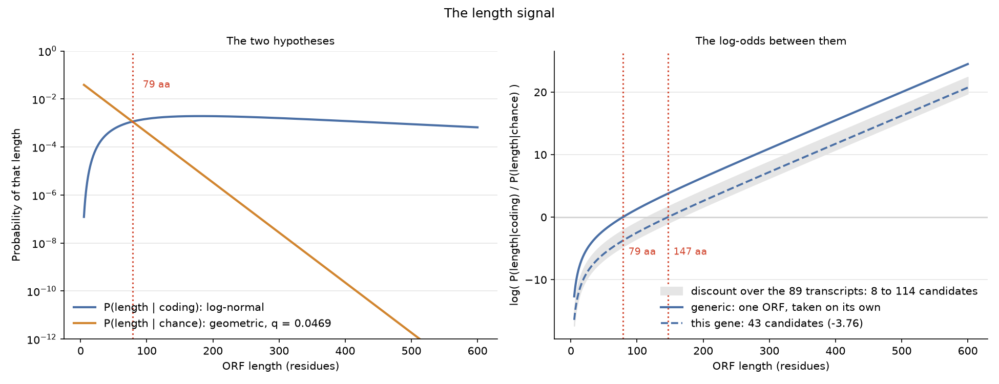

# TP 1: análisis de secuencias

Cada ejercicio se corre por separado desde la raíz del proyecto con el comando `python3 main.py <ejercicio>`, por ejemplo `python3 main.py 4a`. El código está en `exercises/`, las funciones compartidas en `sequences.py`, `stats.py`, `ncbi.py` y `plots.py`. Las secuencias de organismos reales descargadas de bases de datos quedan cacheadas en `data/`; si se borran, la primera corrida vuelve a bajarlas.

---

## Datos

Las proteínas reales las bajamos de **Swiss-Prot** (la mitad _revisada a mano_ de UniProt), donde hay una entrada por gen por organismo y las isoformas figuran como anotaciones adentro de la entrada.

Para la primera versión del TP usamos RefSeq, pero en algún momento decidimos cambiarla por el siguiente motivo: RefSeq es genómico, es decir que tiene un registro por cada gen predicho de cada genoma secuenciado, así que la misma proteína aparece repetida por isoforma y por cepa, y además conviven con entradas sin verificar. Por ejemplo, la query `"Escherichia coli"[Organism] AND refseq[filter]` devuelve 6.666.151 proteínas contra 23.300 en Swiss-Prot, y entre los primeros resultados humanos había cuatro isoformas de una misma proteína seguidas de cinco de otra. 
Otra cosa que tuvimos en cuenta fue usar, para *E. coli*, la cepa K-12 y no la especie entera, porque `"Escherichia coli"[Organism]` matchea todas las cepas secuenciadas y eso reintroduce la redundancia por cepa aun dentro de Swiss-Prot.

De cada organismo se baja el proteoma revisado completo, no una muestra:

| Organismo | Proteínas | Residuos | Largo medio obtenido de los datos | Largo medio conocido |
|---|---|---|---|---|
| *E. coli* K-12 | 6.062 | 1.848.964 | 305 | ~316 |
| *S. cerevisiae* | 7.888 | 3.544.698 | 449 | ~450 |
| *H. sapiens* | 20.591 | 11.454.685 | 556 | ~560 |

Los tres largos medios coinciden con el valor conocido de cada proteoma, así que confiamos en que la descarga no quedó sesgada. Bajar todos los registros fue una decisión que no tomamos desde un principio sino después de darnos cuenta de que, por ejemplo, tomar los primeros *n* significa quedarse con lo último depositado, porque `esearch` devuelve los ids ordenados por fecha de depósito. Medido sobre K-12, los primeros 400 ids dan un largo medio de 256 residuos contra 304 de 400 sorteados al azar. 

Se aplica además otro filtro en las secuencias descargadas: se descartan aquellas con caracteres no estándar (es decir, en las que aparece algún caracter que no está dentro de los 20 conocidos que devuelve BioPython), como U, O (selenocisteína, pirrolisina, poco frecuentes en los organismos) o X, B, Z, J (caracteres que expresan ambigüedad de residuos o residuos no resueltos).

---

## 4a

> **4a)** Compare Distribución de aminoácidos de secuencia de proteínas al azar vs. secuencias de proteínas reales.

Se comparan cuatro fuentes: tres de organismos reales (_E. coli K-12_, _Yeast_ y _Human_), y una fuente al azar del tamaño del más chico de los tres (1.848.964 residuos, el de *E. coli* K-12). 

Generamos dos gráficos. El primero compara cuatro distribuciones: la random y la de cada organismo real por separado, calculada utilizando todos los residuos disponibles. El segundo compara dos distribuciones: la random y a la que llamamos *Natural*, que combina las distribuciones de los organismos reales (y que será la distribución de referencia que después usa 4e).

Para la primera versión del TP, la fuente al azar se armaba sorteando aminoácidos, lo que teórica y empíricamente llevaba a una distribución de 0,05 para cada uno; en esta versión final se hace traduciendo ADN aleatorio y descartando los codones stop. La diferencia importa porque el código genético no reparte los codones de manera pareja (por ejemplo, leucina tiene seis y metionina uno solo): sortear aminoácidos uniformemente daría una fuente que no se parece a ninguna secuencia obtenida de ADN, y la comparación terminaría midiendo esa desigualdad del código antes que lo que distingue a una proteína real. Igualmente, decidimos dejar esa referencia de 0,05 como línea punteada en ambos gráficos.

Por otro lado, para armar el perfil *Natural* sí decidimos recortar la cantidad de secuencias que se usa de cada organismo real, para evitar que las que constan de más registros (en nuestro caso, _Human_ y luego _Yeast_) pesen más. Se toman, entonces, 1.848.964 residuos de cada organismo, y las listas de proteínas se mezclan antes de recortar para que no queden sólo las depositadas más recientemente.





Medidas con la métrica que luego describimos en 4c, las distancias al perfil Natural son 0,046 para humano, 0,063 para *E. coli*, 0,072 para levadura y 0,131 para la fuente al azar. Es decir que no se ve una diferencia significativa que nos sirva de referencia comparando el perfil entero.

Ahora bien: mirando el gráfico, se nota que hay aminoácidos que tienen más diferencia que otros, como E, K, D, R, C, y aminoácidos que tienen menos, como L, A, G, V.

Más específicamente, L (leucina) aparece con la misma frecuencia en las dos fuentes, 0,098 al azar y 0,100 en los organismos, así que no podemos afirmar que la cantidad de leucina en una secuencia diga algo sobre su origen. R (arginina) es el caso opuesto: 0,098 al azar contra 0,052 en los organismos, una diferencia lo bastante grande como para considerarlas como referencia. Lo mismo ocurre con C (cisteína) (0,033 contra 0,016) y, en sentido inverso, con E (glutamato), D (aspartato) y K (lisina), que los organismos reales usan cerca del doble. 
Los aminoácidos con diferencias significativas son los candidatos para el detector de 4e.

Sin embargo, tenemos un problema: los organismos se diferencian entre sí casi tanto como del azar: _E. coli_ y _Yeast_ están a 0,122, contra los 0,131 que separan a Natural del azar. Es decir, dos proteínas reales de organismos distintos pueden estar tan lejos entre sí como una real de una al azar. Para 4e esto significa que la composición de aminoácidos por sí sola no va a alcanzar, y que habrá que explorar otros criterios.


---

## 4b

> **4b)** Analice cómo cambian las distribuciones al aumentar el tamaño de la secuencia "al azar" analizada, y al incrementar el número de secuencias reales analizadas. ¿Cuándo es suficiente?

A la hora de analizar los datos, se puede crecer en cantidad de residuos o en cantidad de proteínas enteras, y cada comparación nos va a dar un _N suficiente_ que a priori puede ser (y a posteriori veremos que será) distinto. 

Generamos dos gráficos, uno para cada comparación, ambas contra el proteoma completo del organismo (que es la referencia de la distribución real del mismo). 

En ambos casos se toma una muestra parcial, se mide su distancia a la distribución de referencia con la métrica de 4c, y se busca dónde cae por debajo de 0,01 (threshold que elegimos para determinar suficiencia del **N**).

Llamamos **N** al número de residuos donde se cruza el umbral y **K** al número de proteínas enteras. El eje de proteínas aplica sólo a los organismos, porque la fuente al azar se genera como una única cadena y no tiene "secuencias". Cada curva se promedia sobre 5 barajadas del orden, para que no dependa de qué proteínas vinieron primero.



Las cuatro fuentes se estabilizan en el mismo orden de magnitud, alrededor de 3·10⁴ residuos: 29.212 la fuente al azar, 29.269 *E. coli*, 28.594 levadura y 31.641 humano. En proteínas enteras alcanza con unas 230 para *E. coli*, 209 para levadura y 514 para humano. Marcamos, en cada gráfico, el máximo, que es donde nos aseguramos que todos los organismos van a estar estabilizados.

Una cosa interesante a analizar es que los dos ejes no dan el mismo número, pensado en el siguiente sentido: las 514 proteínas humanas suman unos 286.000 residuos, nueve veces el N del eje 1, así que hacen falta más registros para estabilizar la distribución cuando llegan agrupados en proteínas enteras que cuando se cuentan sueltos. La brecha además es mayor cuanto más largas son las proteínas del organismo: 2,4 en *E. coli*, que promedia 305 residuos por proteína, 3,3 en levadura con 449 y 9,0 en humano con 556.

Veamos los gráficos obtenidos con R << N, R ~ N, R >> N, que deberían graficar (valga la redundancia) lo que concluimos de los datos. 



Y así es: el segundo y tercer gráfico son prácticamente idénticos visualmente, y encontramos diferencias con respecto al primero.

Por ejemplo, para R << N, levadura da K en 0,096 cuando su valor real es 0,073, y *E. coli* da L en 0,119 contra 0,106. Con R ≈ N y con R >> N los dos gráficos de abajo son casi idénticos, con diferencias en el tercer decimal: el gráfico del medio ya contiene toda la información significativa que aporta el último, usando el 1,7% de los datos.

Un disclaimer: el resultado depende del orden en que se mezclan los datos: repitiendo la medición con distintos órdenes, el N de la fuente al azar va de 21.900 a 34.400. Por eso el programa arranca siempre desde la misma mezcla, así los números mencionados se pueden reproducir. Lo que se sostiene igual es el orden de magnitud y la relación entre los dos ejes, no la cifra exacta, que es lo importante.

---

## 4c

> **4c)** Elija una métrica que permita comparar dos distribuciones. (p.ej., RMSE).

Usamos la distancia de variación total, implementada en `stats.distributions_distance()`:

```
TV(p, q) = 0,5 · Σ |p(a) − q(a)|
```

La elegimos sobre RMSE porque está acotada entre 0 y 1, y porque se lee directamente como "qué fracción de la masa de probabilidad hay que mover para convertir una distribución en la otra", y permite restringirla a un subconjunto de aminoácidos sumando menos términos, que es lo que se usa en 4d.

---

## 4d

> **4d)** Escriba un código que dadas dos distribuciones las compare y obtenga la métrica correspondiente. Utilícela para: i) ver cómo evolucionan las distribuciones obtenidas en 4a al aumentar el tamaño de la muestra (evaluar cuándo la distribución deja de cambiar). ii) estudiar de manera sistemática las diferencias entre las distribuciones obtenidas en 4a para diferentes muestras (comparar distribuciones de secuencias naturales y al azar).

La parte (i) es el análisis de convergencia de 4b, lo que falta es la parte (ii).

```
              Random DNA     E. coli       Yeast       Human     Natural
  Random DNA       0,000       0,155       0,166       0,110       0,131
     E. coli       0,155       0,000       0,122       0,089       0,063
       Yeast       0,166       0,122       0,000       0,103       0,072
       Human       0,110       0,089       0,103       0,000       0,046
     Natural       0,131       0,063       0,072       0,046       0,000
```

La matriz confirma con todos los pares lo que en 4a se veía en uno: las distancias entre organismos (0,089 -E. Coli vs. Human- a 0,122 -E. Coli vs. Yeast-) están en el mismo orden que las distancias al azar (0,110 a 0,166). Más aún, Yeast está a 0,122 de *E. coli* y a 0,166 del azar (apenas 1,4 veces más lejos).

Para 4e, sin embargo, la pregunta no es cuánto se diferencian dos conjuntos grandes sino si la métrica alcanza para decidir sobre un solo ORF. Para medirlo tomamos fragmentos de proteínas reales y secuencias al azar del mismo largo, calculamos la distancia de cada uno al perfil Natural, y contamos con qué frecuencia el fragmento real queda más cerca que el aleatorio, y llamamos a eso la tasa de aciertos.

Ejemplo mínimo explicativo:
Tomamos tres ORFs reales, dos random. Medimos la distancia entre la distribución de los ORFs reales a la distribución Natural y obtenemos [0,1, 0,2, 0,4], y la distancia entre la distribución de los ORFs randomizados y obtenemos [0,3, 0,5].

Comparamos todas las distancias reales contra todas las random: [0,1 vs 0,3], [0,1 vs 0,5], [0,2 vs 0,3], [0,2 vs 0,5], [0,4 vs 0,3], [0,4 vs 0,5]. Hay 3*2=6 comparaciones en total y el real gana en 5 de esas 6 (pierde sólo 0,4 vs 0,3) → la _tasa de aciertos_ = 5/6 = 0,833.

Si las seis veces hubiera ganado la secuencia real, la _tasa de aciertos_ hubiera sido 6/6=1. Sin embargo, un algoritmo que "no discrimina" entre una secuencia real y una random daría una _tasa de aciertos_ de 0,5: no discriminar se parece a elegir _al azar_, que es como tirar una moneda y decidir en base a eso: si sale cara, es un ORF real, si sale seca, es uno generado de manera random. Por eso, 0,5 es un piso _útil_, y no 0. Una tasa de aciertos nula nos estaría diciendo que nuestro código siempre está eligiendo el ORF random (si este fuera el caso, podríamos modificarlo para que, en el último paso, nos dé al revés, convirtiendo nuestra tasa de aciertos de 0 a 1, no?).

Las comparaciones nos dieron los siguientes resultados, muy en línea con lo que habíamos observado previamente: contraintuitivamente (a priori, uno podría pensar que comparar _más_ data siempre nos va a dar un mejor resultado) nos conviene discriminar por aminoácido y comparar sólo unos pocos: los que aportan información significativa.

```
  largo       20 aa   E R K N C         R C
      16       0,489       0,535       0,618
      30       0,474       0,570       0,636
      60       0,454       0,638       0,711
     120       0,467       0,694       0,777
     250       0,574       0,828       0,895
     400       0,607       0,877       0,935
```



Usando los veinte aminoácidos la tasa de aciertos se queda entre 0,45 y 0,57 hasta los 250 residuos. Como ya mencionamos, una gran parte de los aminoácidos es indistinguible entre el azar y la realidad en términos de distribución. Restringiendo la métrica a los aminoácidos que en 4a se separaban entre las dos fuentes, para 250 residuos la tasa sube a 0,895 con R y C solos, y a 0,828 con E, R, K, N y C (midiendo aminoácido por aminoácido el orden es R 0,900, E 0,733, C 0,699, K 0,636 y D 0,605).

El límite aparece con los fragmentos cortos. A 16 residuos, que es la mediana de los ORFs medidos en 3c, el mejor subconjunto da 0,62 y los veinte juntos dan 0,49. La señal recién se vuelve usable arriba de unos 120 residuos.

De ahí salen tres cosas para 4e: la primera es que el largo es la señal principal, porque es la única que discrimina en ORFs cortos y porque es donde 3c mostró la diferencia más marcada (máximo real de 1121 residuos contra 231 en las secuencias al azar). La composición es una señal pero menos significativa, que sólo aporta valor arriba de unos 100 residuos. Y conviene usar pocos aminoácidos en lugar de los veinte, porque incluir los que no discriminan empeora el resultado.

Queda una objeción posible: R y C se eligieron porque eran los que mejor separaban en estos datos, y la medición se realizó sobre esos mismos datos, así que parte del 0,935 podría ser casualidad de la muestra contada como acierto. Para descartarlo, repetimos el experimento tres veces, dejando un organismo afuera en cada vez. 

Se busca el mejor par distinto de aminoácidos entre los 190 posibles (20*19 / 2 para no contar repetidos, ya que no estamos considerando orden) usando sólo los otros dos, se arma el perfil de referencia también sólo con esos dos, y recién entonces se mide sobre el organismo que quedó afuera, que no participó ni de la elección ni de la referencia.

Es decir, armamos tres perfiles Natural distintos: el primero usando E. Coli y Yeast y  Human para comparar, el segundo usando E. Coli y Human y Yeast para comparar, y el tercero usando Yeast y Human y E. Coli para comparar.

| Organismo afuera | Par elegido | Tasa en los dos de entrenamiento | Tasa en el que quedó afuera |
|---|---|---|---|
| *E. coli* | E R | 0,904 | 0,936 |
| Levadura | E R | 0,850 | 0,882 |
| Humano | C R | 0,959 | 0,886 |

R (arginina) aparece en los tres pares y el segundo aminoácido alterna entre E (glutamato) y C (cisteína), así que la elección no depende del organismo que se mire. Las tasas sobre el organismo dejado afuera van de 0,882 a 0,936, el mismo rango que las de entrenamiento, de modo que el 0,935 de la tabla anterior no era producto de haber elegido mirando los mismos datos. Y, como disclaimer, que en dos de los tres casos la tasa sea mayor sobre el organismo dejado afuera no es un problema: como ya vimos, los organismos difieren en cuán fácil es distinguirlos del azar, y eso pesa más que la diferencia entre elegir y evaluar.


---

## 4e

> **4e)** Detector de ORFs. Escriba un código que: i) levante una secuencia de ADN, ii) obtenga los 6 marcos de lectura posibles y determine los ORFs de cada uno, iii) para cada ORF determine a) la longitud y b) la distribución de aminoácidos, iv) en base a lo analizado determine, a partir del largo y la distribución, una probabilidad de corresponder (o no) a una región codificante, v) para probar el programa diseñe: a) un control positivo, b) un control negativo; luego obtenga de una base de datos un gen eucariota completo y corra su programa. Compare con lo esperado.

Para (iv) hay que combinar dos números de naturaleza distinta, un largo y una distribución. Lo que hicimos fue armar un _cociente de verosimilitudes (CV)_ entre la probabilidad de observar el dato si fuera una región codificante y la de observarlo si fuera un dato al azar: "qué explica mejor este dato, que sea de una región codificante o que sea casualidad?".

`CV = P(dato|codificante) / P(dato|azar)`

Por ejemplo, si da CV=50, el dato es 50 veces más esperable en un gen real que en ADN al azar. Si da 0,02 es al revés, 50 veces más esperable en ADN al azar. Y si da 1, no nos sirve para decidir nada.

Esto lo hacemos igual para el largo y para la composición: por un lado calculamos `P(largo=N|codificante)` contra `P(largo=N|azar)`, y por el otro lo mismo con la distribución de aminoácidos. Nos quedan dos CV, uno por señal.

El tema es que dos CV no se combinan sumándolos: si tomamos las señales como independientes (que es lo que haremos), las probas se multiplican, y los CV también. Por eso, en vez de la proba cruda usamos el logaritmo de cada uno, que convierte ese producto en una suma, lo que además nos beneficia a la hora de hacer el cálculo, ya que multiplicar 300 números chiquitos se va a cero en un float, mientras que sumar 300 logaritmos no. Además, el signo se lee solo: positivo vota codificante, negativo vota azar, y cero es empate.

Para el largo queda así:

| largo | P(L \| cod) | P(L \| azar) | CV | log |
|---|---|---|---|---|
| 20 | 5,1e-05 | 1,9e-02 | 0,0027 | −5,92 |
| 79 | 1,2e-03 | 1,1e-03 | 1,04 | +0,04 |
| 150 | 1,9e-03 | 3,7e-05 | 51 | +3,94 |
| 300 | 1,6e-03 | 2,7e-08 | 58.000 | +10,98 |

En 79 el CV pasa por 1 y el log por 0, que es el cruce que aparece un poco más abajo.

Como la suma va de menos infinito a más infinito, falta un paso para volver a una probabilidad. Bayes escrito como cociente dice que la chance final es la chance inicial por el CV. Nosotros arrancamos con chance inicial 1 (0,5 y 0,5, ninguna hipótesis favorecida), así que la chance final es directamente el producto de los CV, o sea la suma de logaritmos que venimos armando. Entonces exponenciarla nos la devuelve: `e^x = P(codificante|datos) / P(azar|datos)`. Y como entre las dos hipótesis se reparten toda la proba, `P(azar|datos) = 1 - P(codificante|datos)`; despejando queda `P = 1 / (1 + e^-x)`. Es decir que esa fórmula no es un truco para meter el resultado entre 0 y 1, sino simplemente "deshacer el logaritmo". Si la suma da 0, el cociente es `e^0 = 1`, es decir que "ser real es una vez más probable que ser azar": las dos hipótesis empatan. Y como son dos hipótesis en total, empatar le da a cada una una probabilidad de 0,5 (y como la cuenta es monótona, pedir `P > 0,5` es lo mismo que pedir que la suma dé positivo).


### Calculando las señales

La señal de largo calcula esas dos probabilidades para el largo del ORF. Para la probabilidad de que sea real, usamos los largos de las proteínas reales que venimos usando a lo largo de todo el trabajo. Esos largos no forman una campana, pero sus logaritmos sí, y el centro de la curva queda en 352 residuos.



Para el azar calculamos lo siguiente: un ORF se termina cuando aparece un codón stop, y como 3 de los 64 codones son stop, la probabilidad de que un codón termine el ORF es de 3/64 = 0,0469.

Llamemos `q = P(codón stop) = 3/64`; luego `1-q = P(codón no stop)`. Como en una tirada de ADN al azar todos los codones son equiprobables, la probabilidad de obtener un ORF de longitud k (considerando que el codón k-ésimo *es* el codón stop, y que del 0-ésimo al (k-1)-ésimo no lo son) `P(ORF de longitud k) = (1-q)^(k-1)·q`, una geométrica cuya media es `1/q = 64/3 =~ 21`. Este cálculo nos va haciendo a la idea del peso que va a tener el largo del ORF al analizar los resultados: la probabilidad de obtener un ORF de ~350 residuos en una tirada al azar es de `(1-q)^350·q = (61/64)^350·3/64 = ... = 2,4 × 10⁻⁹`.

La señal de composición le asigna a cada aminoácido un peso, definido por el logaritmo del cociente entre su frecuencia en las proteínas reales y la que produce el ADN aleatorio. El peso de un ORF es la suma de los pesos de sus residuos. Los pesos resultantes son coherentes con lo que se midió antes: los más negativos son cisteína (−0,72) y arginina (−0,63), que es exactamente el par que 4d había elegido como el mejor, y los más positivos glutamato (+0,68), lisina (+0,58) y aspartato (+0,47), que también estaban en esa lista. Leucina, por ejemplo, queda en +0,02, y por lo tanto su aparición no es significativa, lo que coincide con 4a, donde aparecía con la misma frecuencia en las dos. Es lo mismo que hicimos en 4d al quedarnos con R y C en lugar de los veinte, aunque un poco mejor: en vez de decidir qué aminoácidos entran y cuáles no, entran los veinte y cada uno pesa según cuán bien discrimina.

### Cuánto pesa cada señal

Sumar las dos señales (largo y composición) tal cual supone que valen lo mismo, y 4d ya había medido que no: el largo discrimina en todo el rango y la composición sólo arriba de unos 100 residuos. Así que al peso de la composición lo elegimos midiendo, sobre 89 transcriptos de ncbi que traen anotada su región codificante. En cada uno sabemos cuál de todos sus ORFs es el verdadero, y eso permite contar aciertos y errores.

```
  peso   tasa aciertos   mejor ORF   falsos positivos   CDS detectado
  0,00       1,000           98%           29%               98%
  0,15       1,000           98%           19%               97%
  0,20       1,000           98%           21%               97%
  0,40       0,999           94%           24%               96%
  0,60       0,998           91%           35%               91%
  0,80       0,993           89%           43%               91%
  1,00       0,988           89%           46%               91%
```

La tasa de aciertos (la métrica de 4d, cuántas veces el CDS real le gana a otro ORF del mismo transcripto) no se mueve: queda entre 0,988 y 1,000 en toda la grilla. Está saturada porque en casi todos los transcriptos el CDS real ya es el ORF más largo, así que esa pregunta la contesta el largo solo. La de falsos positivos, sí se mueve. Esa cuenta en cuántos de los 89 transcriptos hay algún ORF que no es el CDS anotado y que aun así saca P > 0,5, o sea un no-gen que el detector detecta como gen. Va del 29% cuando la composición no cuenta nada hasta el 46% cuando cuenta igual que el largo, y toca el mínimo, 19%, con el peso en 0,15 (la búsqueda se hizo de 0,05 en 0,05).

Con ese peso, 22 de los 4.424 ORFs que no son el CDS pasan 0,5, un 0,5%, repartidos en 17 de los 89 transcriptos. Son 0,2 falsos positivos por transcripto. Y si en lugar del umbral se lee sólo el ORF mejor puntuado, ése es el CDS anotado en el 98% de los casos.

### Corrida sobre un gen real

Se corrió sobre `NM_001317077.2`, un mRNA humano de 1.941 nt bajado de NCBI en formato GenBank, que trae anotada la región codificante y sirve para comparar la predicción con un dato real.



Los dos paneles no son lo mismo. El izquierdo es el detector antes de ver ninguna secuencia: las dos probabilidades sobre el mismo eje, la del azar cayendo en línea recta porque cada codón que se agrega multiplica por `1-q`, y la de codificante que es la log-normal del gráfico anterior. El cruce en 79 es el largo donde ninguna de las dos explica mejor lo observado, y no depende de ningún gen en particular.

El panel derecho agrega lo que aporta cada secuencia. La línea llena sigue siendo genérica, es el logaritmo del cociente entre las dos curvas: negativo por debajo de 79 y creciendo con el largo. Todo lo que está por debajo es el descuento por candidatos que explicamos a continuación, y ese sí depende de la secuencia que se esté puntuando: la banda gris cubre el rango de los transcriptos que miramos, de 8 a 114 candidatos, y la punteada es el gen de la corrida, con sus 43. El umbral, entonces, no es un número del detector sino uno por secuencia: va de 115 a 167 residuos según cuántos ORFs haya que descontar.

Como las dos curvas de probabilidad con respecto a los largos se cruzan en los 79 residuos, en un primer experimento, un ORF por arriba de este umbral lo consideramos evidencia de ser codificante y por debajo de ser aleatorio. Pero hay un "detalle" que nos hizo repensarlo: seis marcos de lectura sobre el gen real producen 43 ORFs, es decir que para definir el umbral tendríamos que pensar en la probabilidad de que lo supere _alguno_ de esos N=43 candidatos, y no la de _uno solo_ de los 43 elegido al azar. Matemáticamente, `P(largo|azar, entre N candidatos)`, que es a lo sumo `N·P(largo|azar)`, que al llevarlo al logaritmo se traduce en restar log(N).

Con este nuevo enfoque, el umbral para este gen particular pasa de 79 a 147 aa.

```
  (ii) 43 ORFs across the six reading frames:
   frame  ORFs  longest   start     end
      +1     5       95     972    1260
      +2     7      202     295     904
      +3     7       57     818     992
      -1     8      138     198     615
      -2     9       82     674     923
      -3     7      119     688    1048

  (iv) Most likely to be coding:
   frame   start     end  length  log-odds   P(cod)
      +2     295     904     202       3,1    0,958
      -1     198     615     138      -1,8    0,140
      -3     688    1048     119      -2,0    0,117
      +1     972    1260      95      -3,4    0,032
```

El ORF más probable de ser codificante es el de 295 a 904, que es exactamente la región codificante anotada en la metadata (iuju!). El segundo candidato está a 4,9 unidades de log-odds de distancia, y ninguno de los otros 42 llega a 0,5, así que el detector hace una sola afirmación sobre esta secuencia y es la correcta.

### Controles

El control positivo son tres proteínas reales de una medusa, una planta y una arquea. Se las convierte en el ADN que las codifica y se las hace pasar por el mismo circuito. Las tres dan 1,000. Ninguna es de los organismos con los que se armó la referencia, por la misma razón por la que en 4d dejamos un organismo afuera.

El control negativo es ADN al azar. Con la semilla fija que quedó en el código da 19 ORFs, el más largo de 64 residuos, con probabilidad 0,014. Como una sola corrida no alcanza para concluir nada, lo repetimos con 200 semillas distintas: en ninguna aparece un ORF por encima de 0,5.

El tercero lo armamos para exponer una limitación puntual. Se toman las mismas tres proteínas y se les mezclan los residuos, dejando el largo y la composición intactos y destruyendo sólo el orden. Una proteína "mezclada" no es una proteína, así que debería puntuar bajo, sin embargo (y obviamente) las dos señales terminan dando exactamente lo mismo que para la original:

```
  organism                                    length         real    scrambled
  Jellyfish - GFP (P42212)                       237    11,948409    11,948409
  Plant - Arabidopsis thaliana                   280    15,825781    15,825781
  Archaeon - Methanocaldococcus jannaschii       225    13,000362    13,000362
```

La tabla muestra las dos señales solas, sin el descuento por cantidad de candidatos. Ese descuento sí las separa un poco, pero por un motivo que no tiene que ver con la mezcla en sí, sino con que el ADN mezclado contiene otra cantidad de ORFs, así que le toca otro descuento.

### Qué se podría mejorar

**Una señal que lea el orden**, como la frecuencia de pares de aminoácidos consecutivos o el uso de codones. Es lo que le falta al detector según el control de mezcla.

**La no independencia del largo y la distribución**, al revés de lo que el método supone. El peso de composición es una suma sobre residuos y crece con el largo igual que la señal de largo.

### Cómo llegamos a esta versión

Nuestra primera versión del detector sumaba las dos señales sin ningún peso, o sea dándoles la misma importancia, y no descontaba por la cantidad de ORFs examinados. Con esa versión el 84% de los transcriptos tenía algún falso positivo y el control negativo fallaba en el 12% de las corridas.

Ambas correcciones salieron de revisar los resultados con Claude, que nos propuso que midiéramos cosas que no estábamos midiendo. Todos los valores finales elegidos se decidieron midiendo, con los números que aparecen en esta sección.